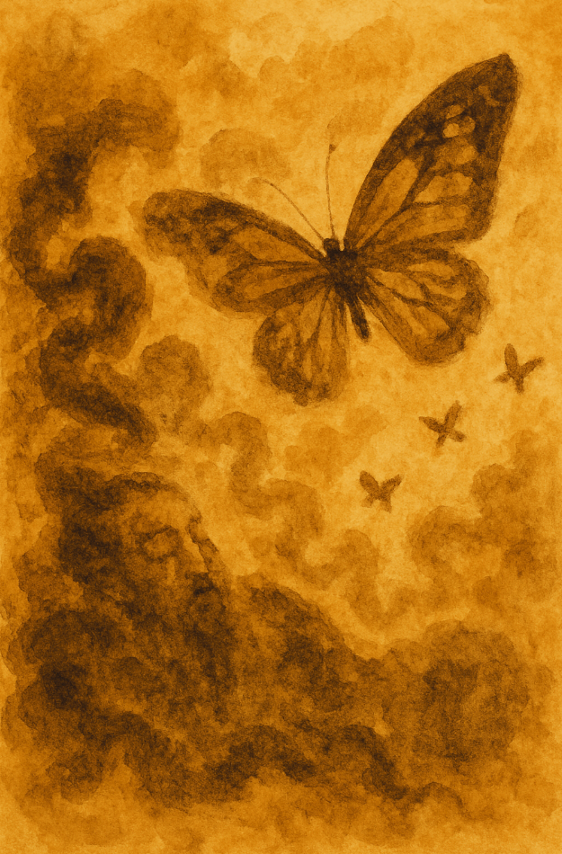

# Illust.Zhuangzi 🦋

**Experience Zhuangzi side-by-side with (AI-generated) artwork.**

As you read through the chapters in the embedded PDF viewer, the adjacent panel displays artwork inspired by prominent motifs in the chapter.

## Features

* **Interactive Reading:** Integrated PDF viewer
* **AI Artwork:** AI-generated images corresponding to specific passages, ranked by significance.
* **Dual Styles:** Toggle between **Naturalistic** and **Abstract** interpretations for each artwork using the **🦋** button.
* **Easy Navigation:**
  * Jump directly to chapters using the top navigation buttons.
  * Use the **←** and **→** arrows to browse artwork within the current chapter.
* **Deeper Insights:** Read the AI's description of the artwork its interpretation of the passage's significance by clicking below the artwork.
* **Light/Dark Mode:** Toggle between **☀️/🌙**.

## How it Works

Website is generated by a Python script (`create_website.py`) that processes metadata linking text passages to pre-generated artwork files. It dynamically creates the HTML, CSS, and JavaScript needed to display the text and images interactively. Hosted statically using GitHub Pages.

---

*Artwork generation and web interface by [Jin Kim](https://www.linkedin.com/in/jinkim2).*
